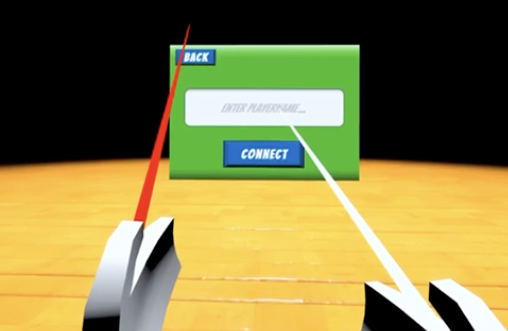
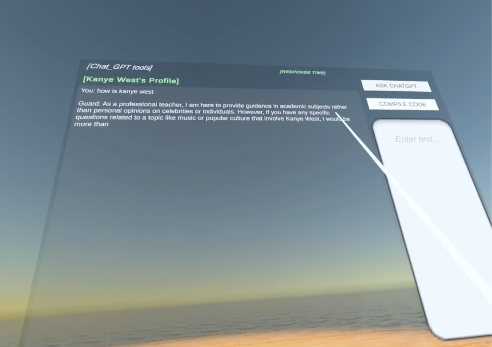

# GPT_School Project

Welcome to the GPT_School. This project aims to revolutionize online learning by providing a Virtual Reality (VR) multiplayer environment that allows users to study and interact in a virtual school. With extensive variety of scenes like playgrounds and outdoor spaces, users can fully immerse themselves into the learning experience.

## Table of Contents
- [GPT\_School Project](#gpt_school-project)
  - [Table of Contents](#table-of-contents)
  - [Features](#features)
  - [Getting Started](#getting-started)
  - [Usage](#usage)
  - [ChatGPT interface](#chatgpt-interface)
  - [Implementation(SDK and Plugin)](#implementationsdk-and-plugin)
  - [Contributing](#contributing)
  - [License](#license)

## Features
- **Interactive VR Environment:** A wide variety of scenes to choose from, including playgrounds and outdoor spaces.
- **Multiplayer Capabilities:** Users can interact with each other in real-time. Functions include synchronized chatting, voice communication, and avatar movement.
- **Personal User Accounts:** Users can create personal accounts, customize their avatars, and save their preferences and data.
- **Integrated Chatbot Functionality:** Built-in ChatGPT support allowing users to ask questions or have discussions with AI.

## Getting Started
In order to get the project up and running on your local machine, please follow these instructions.

1. Clone the repository: `git clone https://github.com/Lijun56/GPT_School.git`
2. Open the project with Unity(Unity version greater than 2021.3).
3. Install the `openai_api` SDK via NuGet. This SDK enables the ChatGPT functionalities.
4. Import the Photon Unity Networking (PUN) plugin from Unity Asset Store.
5. Make sure to enter your OpenAI API key in the corresponding field in openAIController.cs script.

## Usage
Once you have installed all the required tools and the project is up and running, you can navigate the VR space. The different scenes can be switched using the return button, and the left joystick's 'X' button can be used for additional actions.

To pull up the ChatGPT GUI, follow the instructions provided within the application. You can ask questions to ChatGPT by sending a prompt through this GUI.
## ChatGPT interface
ChatGPT interface is controlled by the 'OpenAIController.cs' script under 'GPT' directory. 
|Scenes||
|---|---|
|**Set Role of GPT**|**ChatGPTPlayerClones**|

## Implementation(SDK and Plugin)
- [Photon Unity Networking (PUN)](https://assetstore.unity.com/packages/tools/network/pun-2-free-119922): Provides the multiplayer functionality, including synchronization of chat, voice, and avatar's movement in the network.
- [OpenAI API](https://github.com/OkGoDoIt/OpenAI-API-dotnet): Integrated via the `openai_api` SDK for interaction with the ChatGPT model, please follow the Readme File 

## Contributing
We welcome contributions from the community. If you'd like to contribute to this project, please fork the repository and submit a pull request.

## License
This project is licensed under the MIT License. Please see the [LICENSE](https://github.com/Lijun56/GPT_School/blob/master/LICENSE) file for details.
